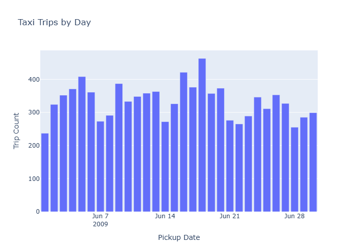

# Workshop 1 Homework

All questions were answered using the Copilot agent in VS Code. It took several iterations with the agent to get to a successful pipeline, but after sevral errors and retrys, the agent created a completed pipeline. 

For example: 

> Copilot has been working on this problem for a while. It can continue to iterate, or you can send a new message to refine your prompt.

> [!NOTE]
> Perfect! The pipeline is now working successfully! 🎉
>
> Looking at the output, I can see:
>
> Extracted 10,000 taxi trip records from pages 1-10
> Normalized the data (10,001 items including pipeline state)
> Successfully loaded to DuckDB database at taxi_pipeline.duckdb
> No failed jobs - Load package is LOADED


## Question 1: What is the start date and end date of the dataset?

```
import duckdb
con = duckdb.connect('taxi_pipeline.duckdb')
con.execute('''
    SELECT
        MIN(trip_pickup_date_time) AS start,
        MAX(trip_pickup_date_time) AS end
    FROM taxi_pipeline_dataset.taxi_trips
''').fetchall()

[(datetime.datetime(2009, 6, 1, 5, 33, …), datetime.datetime(2009, 6, 30, 17, 58, …))]
```


## Question 2: What proportion of trips are paid with credit card?

```Python
<<'PYCODE'
import duckdb
con = duckdb.connect('taxi_pipeline.duckdb')

result = con.execute('''
    SELECT
        COUNT(*) as total_trips,
        SUM(CASE WHEN payment_type = 'Credit' THEN 1 ELSE 0 END) as credit_trips,
        ROUND(100.0 * SUM(CASE WHEN payment_type = 'Credit' THEN 1 ELSE 0 END) / COUNT(*), 2) as credit_percentage
    FROM taxi_pipeline_dataset.taxi_trips
''').fetchall()

total, credit, pct = result[0]
print(f"Total trips: {total}")
print(f"Credit card trips: {credit}")
print(f"Credit card percentage: {pct}%")
PYCODE
```
26.66% of trips are paid with credit card (2,666 out of 10,000 total trips).

For reference, the payment breakdown is:

**CASH**: 7,332 trips (73.32%)
**Credit**: 2,666 trips (26.66%)
**No Charge**: 1 trip (0.01%)
**Dispute**: 1 trip (0.01%)


## Question 3: What is the total amount of money generated in tips?

```Python
<<'PYCODE'
import duckdb
con = duckdb.connect('taxi_pipeline.duckdb')

result = con.execute('''
    SELECT
        SUM(tip_amt) as total_tips,
        AVG(tip_amt) as avg_tip,
        MIN(tip_amt) as min_tip,
        MAX(tip_amt) as max_tip
    FROM taxi_pipeline_dataset.taxi_trips
''').fetchall()

total, avg, min_tip, max_tip = result[0]
print(f"Total tips: ${total:.2f}")
print(f"Average tip per trip: ${avg:.2f}")
print(f"Min tip: ${min_tip:.2f}")
print(f"Max tip: ${max_tip:.2f}")
PYCODE

```

The total amount of money generated in tips is $6,063.41.

Additional tip statistics:

**Average tip per trip**: $0.61
**Minimum tip**: $0.00
**Maximum tip**: $38.80


## Extra
>
>Create a marimo notebook that visualizes which day had the most taxi trips by count. Use ibis for data access. Reference: https://dlthub.com/docs/general-usage/dataset-access/marimo

